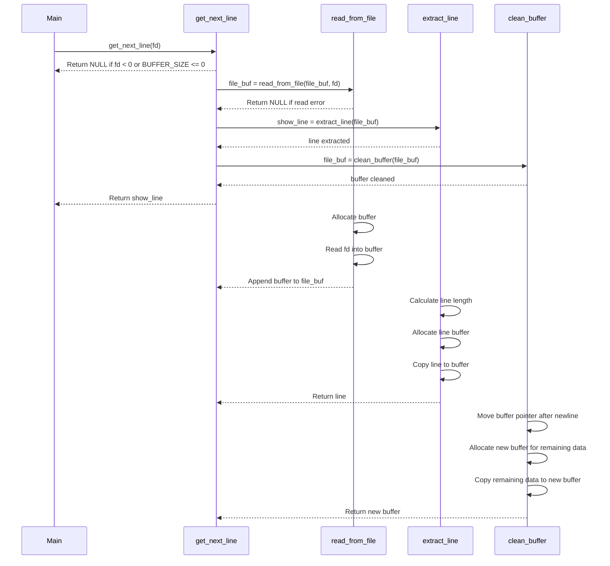

# get_next_line
**get_next_line** is a function that reads and returns a line from a file descriptor. This README provides details on the implementation, usage, compilation instructions, code and logic used for the project.  
# Index   
- [Description](#description)
  	- [Function Prototype](#fun_prototype)
	- [Parameters](#parameters) 
	- [Return value](#return)
	- [Allowed functions](#allow)
	- [Project files](#pr_files)
		- [Header file](#hd_file)
		- [Helper functions](#hp_file)
	- [Buffer size](#buff_file)
	- [Compilation](#compilation)
	- [Usage](#usage)
	- [Notes](#notes)
- [Logic and Implementation](#logic)
	- [High-Level Overview](#h_level)
	- [Detail steps](#detail)
	- [Pseudo Code](#pseudo)
	- [Sequence Diagram of get_next_line Function and Subfunctions](#diagram)
	- [Code explanation](#code)
- [Bonus](#bonus)
	- [Bonus Requirements](#b_req)
	- [Bonus files](#b_files)
	- [Compilation for Bonus Part](#b_compilation)
	- [Usage for Bonus Part](#b_usage)
- [Acknowledgements](#ack)
### _Description_ <a name="description"></a>
The **get_next_line** function reads from the file descriptor fd and returns the next line from the file.
Repeatedly calling get_next_line in a loop allows reading the file line by line until the end.
The function returns the line that has just been read.
If there is nothing more to read or an error occurs, it returns **NULL**.
The function should work properly when reading from both a file and stdin.
The returned line should end with the newline character **\n**, except if the end of the file is reached and it does not end with a newline.
#### Function Prototype<a name="fun_prototype"></a>
``
char *get_next_line(int fd);
``
#### Parameters <a name="parameters"></a>
**fd**: The file descriptor from which to read.
#### Return Value <a name="return"></a>
* Returns the line read if successful.
* Returns **NULL** in case of an error or when the end of the file is reached.
#### Allowed Functions <a name="allow"></a>
* **read**
* **malloc**
* **free**
#### Project Files <a name="pr_files"></a>
* **get_next_line.c**
* **get_next_line_utils.c**
* **get_next_line.h**
#### Header File <a name="hd_file"></a>
The **get_next_line.h** header file should at least contain the prototype for the **get_next_line** function.
#### Helper Functions <a name="hp_file"></a>
Add any necessary helper functions in the **get_next_line_utils.c** file.
#### Buffer Size <a name="buff_file"></a>
the program must compile with the flag **-D BUFFER_SIZE=xx**. This flag will be used to set the buffer size for the reads in **get_next_line()**. This parameter will be changed by evaluators and the testing system to test the program.
The project must compile with and without the **-D BUFFER_SIZE** flag, along with the usual flags. You can choose any default buffer size.
#### Compilation <a name="compilation"></a>
Compile the project with the following command (using a buffer size of 42 as an example):  
``
cc -Wall -Werror -Wextra -D BUFFER_SIZE=42 get_next_line.c get_next_line_utils.c -o get_next_line
``
#### Usage <a name="usage"></a>
To use the get_next_line function in your project, include the **get_next_line.h** header and compile thr project with the appropriate source files. Below is an example:
````
#include "get_next_line.h"
#include <fcntl.h>
#include <stdio.h>
int	main(void)
{
	int	fd;
	char	*line;
	int	lines;

	fd = open("text.txt", O_RDONLY);
	if (fd == -1)
	{
		printf("Error al abrir el archivo\n");
		return (1);
	}
	printf("BUFFER_SIZE:%i\n", BUFFER_SIZE);
	lines = 1;
	while ((line = get_next_line(fd)) != NULL)
	{
		printf("buffer --> %i %s\n", lines++, line);
		free(line);
	}
	close(fd);
	return (0);
}
````
#### Notes <a name="notes"></a>
* **get_next_line()** has undefined behavior if the file pointed to by **fd** changes after the last call, provided **read()** has not reached the end of the file.
* **get_next_line()** has undefined behavior when reading a binary file.
### _Logic and Implementation_ <a name="logic"></a>
#### High-Level Overview <a name="h_level"></a>
**1.** **Static Buffer**: Use a static buffer to store read data across multiple calls to **get_next_line**.  
**2.** **Reading Loop**: Continuously read from the file descriptor until a newline character **\n** is encountered or the end of the file is reached.  
**3.** **Line Extraction**: Extract the line from the buffer and manage the remaining data for subsequent calls.  
**4.** **Dynamic Memory Management**: Use **malloc** to allocate memory for the line to be returned and **free** to release it when no longer needed.  
#### Detailed Steps <a name="detail"></a>
**1.** **Initialize Static Variables**: Use a static variable to keep track of the buffer across function calls.  
**2.** **Read from File Descriptor**: Use the read function to fill the buffer until a newline character is found or the end of the file is reached.  
**3.** **Buffer Management**: Keep track of the buffer's start and end positions to manage partially read data.  
**4.** **Return Line**: Allocate memory for the line, copy the relevant portion of the buffer to it, and return the line.  
**5.** **Handle End of File and Errors**: Ensure that the function returns NULL when the end of the file is reached or an error occurs.  
#### Pseudo Code <a name="pseudo"></a>
````
function get_next_line(fd):
    if fd < 0 or BUFFER_SIZE <= 0:
        return NULL

    file_buf = read_from_file(file_buf, fd)
    if file_buf is NULL:
        return NULL

    show_line = extract_line(file_buf)
    file_buf = clean_buffer(file_buf)
    return show_line  

function read_from_file(file_buf, fd):
    while no newline in file_buf and char_read != 0:
        buf = allocate BUFFER_SIZE + 1 bytes
        char_read = read(fd, buf, BUFFER_SIZE)
        if char_read < 0:
            free buffers and return NULL
        buf[char_read] = '\0'
        file_buf = append_buffers(file_buf, buf)
        free(buf)
    return file_buf

function extract_line(file_buf):
    if file_buf is empty:
        return NULL
    line_len = length to newline in file_buf
    line = allocate line_len + 1 bytes
    copy data from file_buf to line
    return line

function clean_buffer(file_buf):
    if file_buf is empty:
        return NULL
    move buffer pointer to after newline
    allocate new buffer for remaining data
    copy remaining data to new buffer
    free old buffer
    return new buffer

function append_buffers(file_buf, buf):
    allocate new buffer of size file_buf + buf
    copy data from file_buf and buf to new buffer
    free old file_buf
    return new buffer
````
#### Sequence Diagram of get_next_line Function and Subfunctions <a name="diagram"></a>

#### Code Explanation <a name="code"></a>
* **ft_read_from_file**: Reads from the file descriptor and appends the content to a buffer until a newline character is found or the end of the file is reached.
* **ft_get_line**: Extracts the next line from the buffer.
* **ft_clean_file_buf**: Cleans up the buffer by removing the content up to and including the first newline character.
* **get_next_line**: The main function that coordinates reading from the file, extracting the line, and cleaning the buffer.
* **ft_strlen**: Calculates the length of a string.
* **ft_len_to_newline**: Calculates the length from the beginning of the buffer to the first newline character.
* **ft_copy_line**: Copies characters from the buffer to a line buffer until a newline character is encountered.
* **ft_find_nextline**: Checks if there is a newline character in the buffer.
* **ft_append_char_read**: Appends the content of a temporary buffer to the main buffer.
### _Bonus Part_ <a name="bonus"></a>
To enhance the functionality of get_next_line with these additional features:
#### Bonus Requirements <a name="b_req"></a>
* Implement **get_next_line()** using only one static variable.
* **get_next_line()** should be able to manage multiple file descriptors simultaneously. For example, if you have three file descriptors (e.g., 3, 4, and 5), you should be able to use **get_next_line** on fd 3, then on fd 4, and then on fd 5 alternately, without losing the reading thread of each **fd**.
#### Bonus Files <a name="b_files"></a>
In addition to the mandatory files, you need to deliver the following files for the bonus part:
* **get_next_line_bonus.c**
* **get_next_line_bonus.h**
* **get_next_line_utils_bonus.c**
#### Compilation for Bonus Part<a name="b_compilation"></a>
Compile the bonus part with the following command (using a buffer size of 42 as an example):  
``cc -Wall -Werror -Wextra -D BUFFER_SIZE=42 get_next_line_bonus.c get_next_line_utils_bonus.c -o get_next_line_bonus``
#### Usage for Bonus Part <a name="b_usage"></a>
The usage remains the same as the mandatory part, but now **get_next_line** can handle multiple file descriptors.
### *Acknowledgements* <a name="ack"></a>
This project is part of the curriculum at [42 Madrid](https://www.42madrid.com/). Thanks to the 42 Network for providing the resources and guidance to complete this project.

